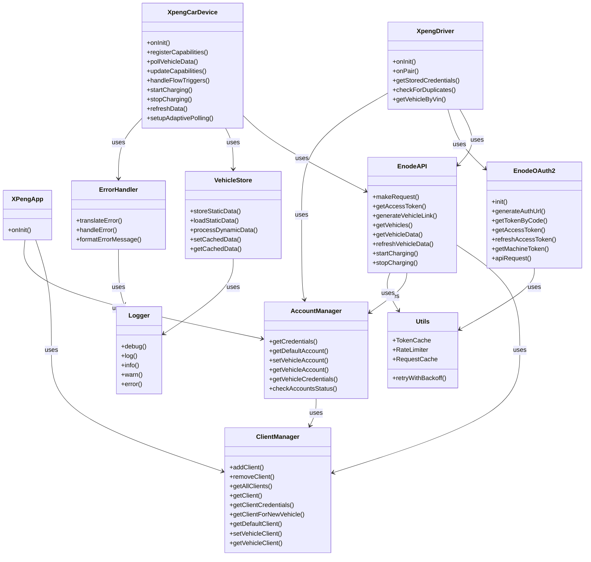
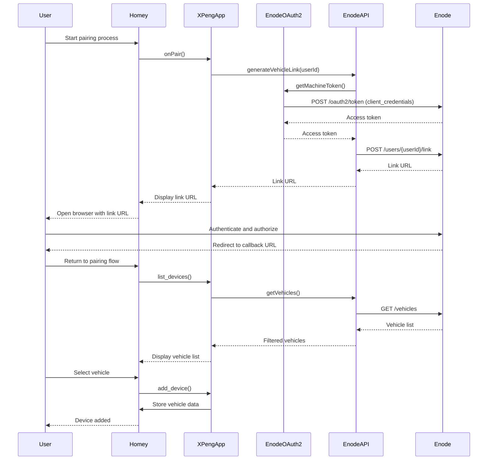
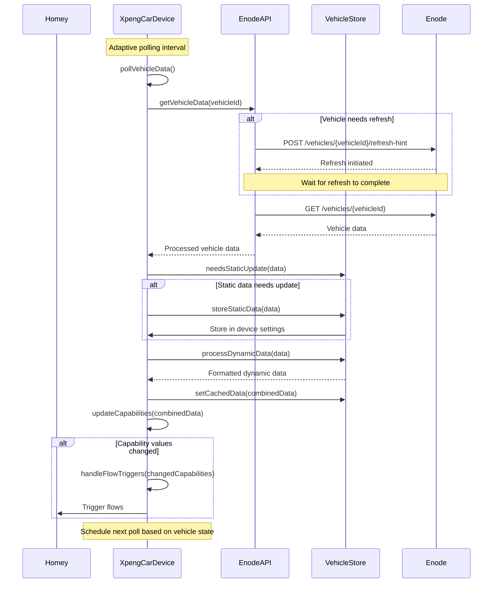

# Architecture Overview

## Core Components

The XPENG Car Manager is built on top of the Homey platform and integrates with XPENG vehicles through the Enode API. The application follows a modular architecture with clear separation of concerns.

### Class Architecture



### App Structure

```
xpeng-homey/
├── app.js              # Main application entry point
├── drivers/            # Device drivers for Xpeng vehicles
│   └── cars/           # XPENG car driver implementation
├── lib/                # Shared utilities and helpers
│   ├── account-manager.js    # Manages Enode accounts
│   ├── client-manager.js     # Manages multiple Enode clients
│   ├── enode-api.js          # Enode API integration
│   ├── enode-oauth.js        # OAuth2 authentication
│   ├── enode-machine-token.js # Machine token handling
│   ├── errorHandler.js       # Centralized error handling
│   ├── logger.js             # Enhanced logging
│   ├── settingsManager.js    # Settings management
│   ├── utils.js              # Utility functions
│   └── vehicle-store.js      # Vehicle data management
├── .homeycompose/     # Flow actions and conditions
└── widgets/           # Custom widgets for the Homey dashboard
```

## Main Components

### 1. App Core (app.js)

The main application class (`XPengApp`) handles:
- App initialization
- Client and account management
- Settings initialization
- Logging and error handling

```javascript
class XPengApp extends Homey.App {
  async onInit() {
    // Initialize settings
    await SettingsManager.initializeSettings(this.homey, Logger);

    // Initialize client manager
    this.clientManager = new ClientManager(this.homey);

    // Initialize account manager
    this.accountManager = new AccountManager(this.homey);

    // Initialize primary and secondary clients
    // ...
  }
}
```

### 2. Authentication

The app uses OAuth 2.0 for authentication with the Enode API. Two authentication flows are implemented:

1. **Client Credentials Flow**:
   - Used for management API calls
   - Implemented in the `enode-machine-token.js` module
   - Provides access tokens for API calls that don't require user authentication

2. **Authorization Code Flow**:
   - Used for user authentication during pairing
   - Implemented in the `EnodeOAuth2` class
   - Provides access tokens for API calls that require user authentication

### 3. Multi-Client Architecture

The application supports multiple Enode clients through the `ClientManager` class. This allows the app to support unlimited clients for scaling beyond the 25-vehicle limit per client.

The multi-client architecture includes:

- **Client Registry**: Stores information about all clients
- **Vehicle-to-Client Mapping**: Associates vehicles with specific clients
- **Client Selection**: Selects the appropriate client for new vehicles
- **Credential Management**: Provides client credentials for API requests

### 4. Vehicle Integration

Vehicle data and control is managed through:
- `EnodeAPI` class for vehicle status and control
- `VehicleStore` class for data processing and caching
- Adaptive polling for real-time data updates
- Command execution (charging control)

### 5. Flow Actions

The app provides several flow actions for automation:
- Start/Stop charging
- Data refresh
- Vehicle status updates

## Data Flow

### Authentication Flow



### Vehicle Data Flow



The vehicle data flow consists of:

1. **Polling Cycle**
   - Device initiates polling based on adaptive interval
   - EnodeAPI retrieves vehicle data from Enode
   - VehicleStore processes and caches the data
   - Device updates capabilities based on the data
   - Device triggers flows based on capability changes

2. **Command Processing**
   - Commands are validated by the device
   - EnodeAPI sends commands to Enode API
   - EnodeAPI waits for command completion
   - Device polls for updated data
   - Capability updates trigger flow cards

3. **Adaptive Polling**
   - Polling interval adjusts based on vehicle state
   - More frequent polling when vehicle is active
   - Less frequent polling when vehicle is idle
   - Polling frequency increases during charging

## Security Considerations

- **Credential Storage**: All sensitive credentials (client IDs, client secrets) are stored in env.json, which is encrypted when published to the Homey App Store.

- **Token Management**: Access tokens are stored in memory and refreshed automatically when expired.

- **Vehicle Filtering**: The application implements filtering to ensure users only see their own vehicles.

- **Error Handling**: Error messages are sanitized to prevent information disclosure.

- **Rate Limiting**: Implementation of rate limiting helps prevent API abuse.

## Performance Optimizations

- **Caching**: The application implements caching for tokens and API responses to reduce API calls.

- **Rate Limiting**: The application implements rate limiting to prevent hitting API rate limits.

- **Adaptive Polling**: Polling interval adjusts based on vehicle state to optimize data freshness and API usage.

- **Request Batching**: The application batches multiple API requests when possible.

- **Retry with Backoff**: Failed operations are retried with exponential backoff.

## Integration Points

### Enode API
- OAuth2 authentication
- Vehicle data retrieval
- Command execution
- Multi-client support

### Homey Platform
- Settings management
- Flow actions and triggers
- Device capabilities
- Widget integration
