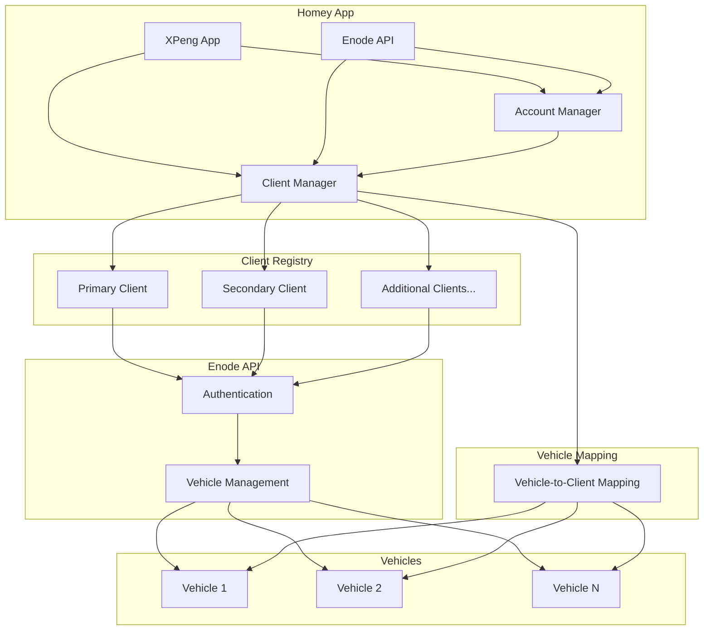

# Multi-Client Architecture

This document provides a detailed explanation of the multi-client architecture implemented in the XPENG Car Manager Homey application.

## Overview

The XPENG Car Manager supports multiple Enode clients to overcome the 25-vehicle limit per client imposed by the Enode API. This architecture allows the application to scale to support an unlimited number of vehicles while maintaining backward compatibility with existing installations.



## Key Components

### ClientManager

The `ClientManager` class is the core component of the multi-client architecture. It is responsible for:

- Managing client credentials
- Associating vehicles with clients
- Selecting the appropriate client for new vehicles
- Providing client credentials for API requests

```javascript
class ClientManager {
  constructor(homey) {
    this.homey = homey;
    this.SETTINGS_KEYS = {
      CLIENTS: 'enode_clients',
      VEHICLE_CLIENT_MAPPING: 'vehicle_client_mapping'
    };
  }

  // Add a new client to the registry
  addClient(clientId, clientSecret, name = null) {
    const clients = this.getAllClients();
    const existingClient = clients.find(client => client.id === clientId);

    if (existingClient) {
      return false; // Client already exists
    }

    clients.push({
      id: clientId,
      secret: clientSecret,
      name: name || `Client ${clients.length + 1}`
    });

    this.homey.settings.set(this.SETTINGS_KEYS.CLIENTS, clients);
    return true;
  }

  // Get all registered clients
  getAllClients() {
    return this.homey.settings.get(this.SETTINGS_KEYS.CLIENTS) || [];
  }

  // Get a specific client by ID
  getClient(clientId) {
    const clients = this.getAllClients();
    return clients.find(client => client.id === clientId);
  }

  // Get client credentials for a specific client
  getClientCredentials(clientId) {
    const client = this.getClient(clientId);
    if (!client) {
      return null;
    }

    return {
      clientId: client.id,
      clientSecret: client.secret
    };
  }

  // Get the default client (first client in the registry)
  getDefaultClient() {
    const clients = this.getAllClients();
    return clients.length > 0 ? clients[0].id : null;
  }

  // Associate a vehicle with a specific client
  setVehicleClient(vehicleId, clientId) {
    const mapping = this.homey.settings.get(this.SETTINGS_KEYS.VEHICLE_CLIENT_MAPPING) || {};
    mapping[vehicleId] = clientId;
    this.homey.settings.set(this.SETTINGS_KEYS.VEHICLE_CLIENT_MAPPING, mapping);
  }

  // Get the client associated with a specific vehicle
  getVehicleClient(vehicleId) {
    const mapping = this.homey.settings.get(this.SETTINGS_KEYS.VEHICLE_CLIENT_MAPPING) || {};
    return mapping[vehicleId] || this.getDefaultClient();
  }

  // Get the client for a new vehicle (client with fewest vehicles)
  getClientForNewVehicle() {
    // Get all clients
    const clients = this.getAllClients();

    // Count vehicles per client
    const vehicleCounts = {};
    clients.forEach(client => {
      vehicleCounts[client.id] = 0;
    });

    // Count existing vehicles
    const mapping = this.homey.settings.get(this.SETTINGS_KEYS.VEHICLE_CLIENT_MAPPING) || {};
    Object.values(mapping).forEach(clientId => {
      if (vehicleCounts[clientId] !== undefined) {
        vehicleCounts[clientId]++;
      }
    });

    // Find the first client that isn't full (less than 25 vehicles)
    const MAX_VEHICLES_PER_CLIENT = 25;

    for (const client of clients) {
      const count = vehicleCounts[client.id] || 0;
      if (count < MAX_VEHICLES_PER_CLIENT) {
        return client.id;
      }
    }

    // If all clients are full, use the last one as fallback
    return clients[clients.length - 1].id;
  }
}
```

### AccountManager

The `AccountManager` class provides backward compatibility with the legacy account-based architecture. It is a wrapper around the `ClientManager` class that maintains the same interface as the legacy code.

```javascript
class AccountManager {
  constructor(homey) {
    this.homey = homey;
    this.clientManager = homey.clientManager;
  }

  // Get credentials for a specific account
  getCredentials(accountId = 'default') {
    if (accountId === 'default') {
      return this.clientManager.getClientCredentials(this.clientManager.getDefaultClient());
    } else {
      return this.clientManager.getClientCredentials(accountId);
    }
  }

  // Get the default account (first client in the registry)
  getDefaultAccount() {
    return this.clientManager.getDefaultClient();
  }

  // Associate a vehicle with a specific account
  setVehicleAccount(vehicleId, accountId) {
    this.clientManager.setVehicleClient(vehicleId, accountId);
  }

  // Get the account associated with a specific vehicle
  getVehicleAccount(vehicleId) {
    return this.clientManager.getVehicleClient(vehicleId);
  }

  // Get credentials for a specific vehicle
  getVehicleCredentials(vehicleId) {
    const accountId = this.getVehicleAccount(vehicleId);
    return this.getCredentials(accountId);
  }
}
```

### EnodeAPI

The `EnodeAPI` class is responsible for making API requests to the Enode API. It uses the `ClientManager` to get the appropriate client credentials for each request.

```javascript
class EnodeAPI {
  constructor(homey) {
    this.homey = homey;
    this.clientManager = homey.clientManager;
    this.accountManager = homey.accountManager;
  }

  // Get access token for a specific vehicle
  async getAccessToken(vehicleId, accountId = null) {
    if (!accountId) {
      accountId = this.clientManager.getVehicleClient(vehicleId);
    }

    const credentials = this.clientManager.getClientCredentials(accountId);
    return await getMachineToken(credentials, accountId);
  }

  // Get vehicles from all clients
  async getVehicles(clientId = null, getAllClients = true) {
    // If getAllClients is true, fetch vehicles from all clients and merge them
    if (getAllClients) {
      let allVehicles = [];

      // Get vehicles from each client
      const clients = this.clientManager.getAllClients();
      for (const client of clients) {
        const clientVehicles = await this._getVehiclesForClient(client.id);
        allVehicles = [...allVehicles, ...clientVehicles];
      }

      // Apply filtering logic
      return await this._filterVehicles(allVehicles);
    } else {
      // Get vehicles from a specific client
      return await this._getVehiclesForClient(clientId);
    }
  }

  // Get vehicles for a specific client
  async _getVehiclesForClient(clientId) {
    const credentials = this.clientManager.getClientCredentials(clientId);
    const accessToken = await getMachineToken(credentials, clientId);

    // Make API request
    const response = await this.makeRequest(
      `${this.apiBaseUrl}/vehicles`,
      {
        headers: {
          Authorization: `Bearer ${accessToken}`,
          'Content-Type': 'application/json',
          'Accept': 'application/json'
        },
      }
    );

    const data = await response.json();

    // Add client ID to each vehicle
    return data.map(vehicle => ({
      ...vehicle,
      _clientId: clientId
    }));
  }
}
```

## Vehicle-to-Client Mapping

The application maintains a mapping between vehicles and clients to ensure that each vehicle is always associated with the same client. This mapping is stored in the Homey settings and is used to determine which client to use for API requests for a specific vehicle.

```javascript
// Example mapping
{
  "vehicle_1_id": "client_1_id",
  "vehicle_2_id": "client_1_id",
  "vehicle_3_id": "client_2_id"
}
```

## Client Selection for New Vehicles

When a new vehicle is added to the application, the `ClientManager` selects the appropriate client for the vehicle. The selection is based on the number of vehicles already associated with each client, with a preference for clients that have fewer than 25 vehicles.

```javascript
getClientForNewVehicle() {
  // Get all clients
  const clients = this.getAllClients();

  // Count vehicles per client
  const vehicleCounts = {};
  clients.forEach(client => {
    vehicleCounts[client.id] = 0;
  });

  // Count existing vehicles
  const mapping = this.homey.settings.get(this.SETTINGS_KEYS.VEHICLE_CLIENT_MAPPING) || {};
  Object.values(mapping).forEach(clientId => {
    if (vehicleCounts[clientId] !== undefined) {
      vehicleCounts[clientId]++;
    }
  });

  // Find the first client that isn't full (less than 25 vehicles)
  const MAX_VEHICLES_PER_CLIENT = 25;

  for (const client of clients) {
    const count = vehicleCounts[client.id] || 0;
    if (count < MAX_VEHICLES_PER_CLIENT) {
      return client.id;
    }
  }

  // If all clients are full, use the last one as fallback
  return clients[clients.length - 1].id;
}
```

## Backward Compatibility

The multi-client architecture maintains backward compatibility with existing installations through the `AccountManager` class. This class provides the same interface as the legacy code but delegates to the `ClientManager` for actual implementation.

## Security Considerations

The multi-client architecture includes several security considerations:

- **Credential Storage**: All client credentials are stored in the Homey settings, which are encrypted when published to the Homey App Store.
- **Vehicle Filtering**: The application implements filtering to ensure users only see their own vehicles.
- **Client Isolation**: Each client has its own credentials and token cache, ensuring that a compromise of one client does not affect others.

## Conclusion

The multi-client architecture provides a scalable solution for the XPENG Car Manager Homey application, allowing it to support an unlimited number of vehicles while maintaining backward compatibility with existing installations. The architecture is designed to be transparent to users, who should not be aware of the underlying client structure.
